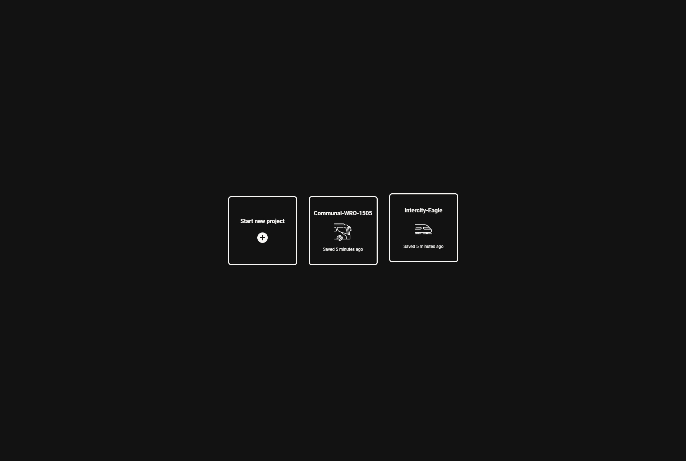
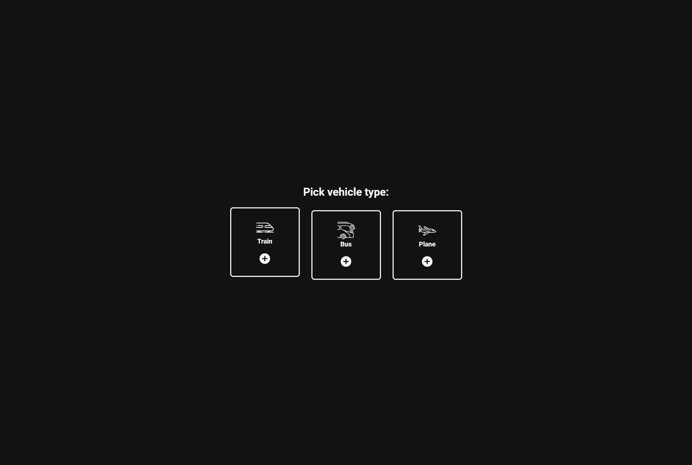
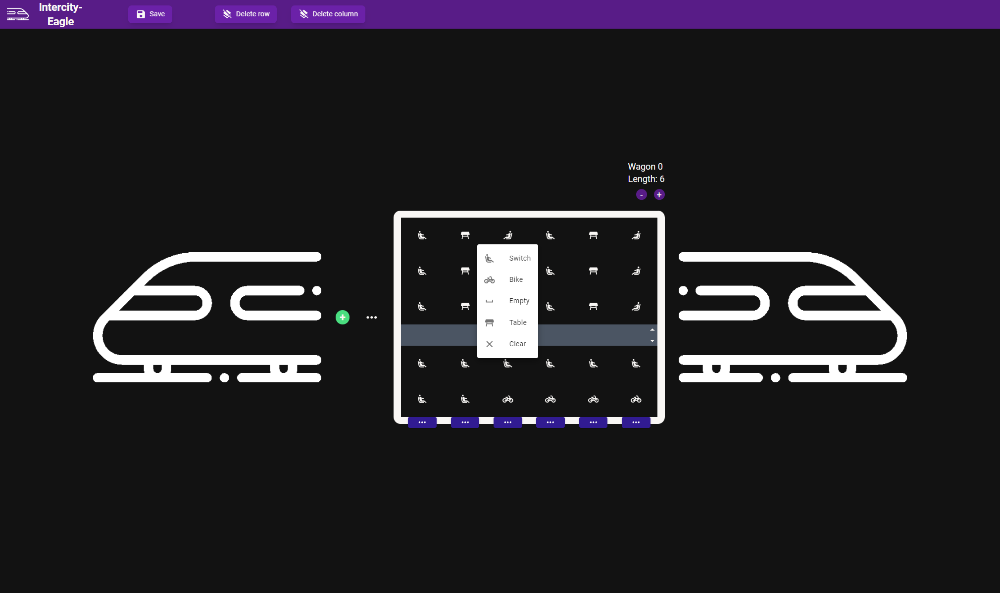
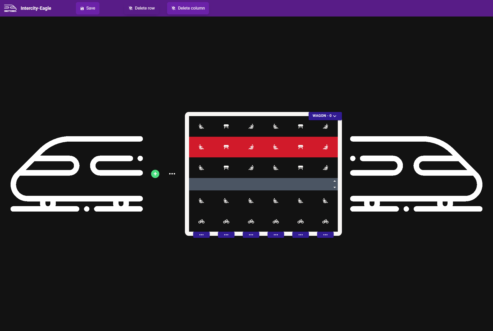
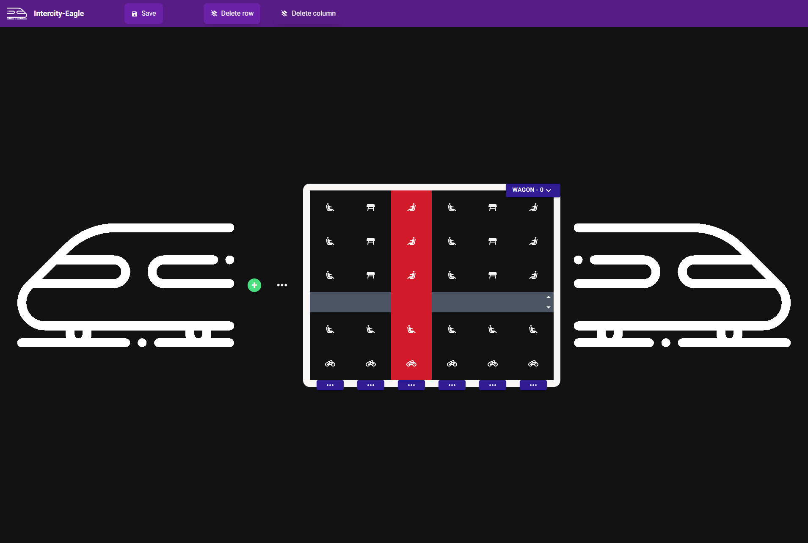
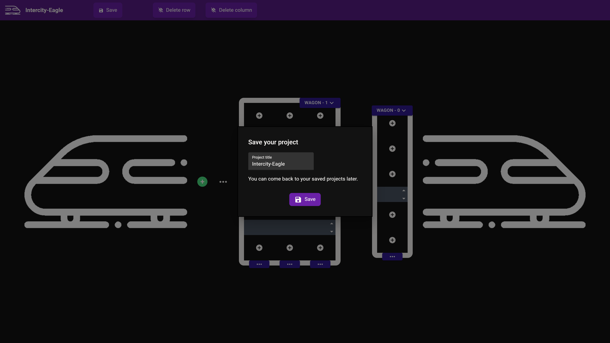

# Vehicle drawer

This is a vehicle drawing app. Create your fleet (and coming soon -  sell tickets for your commune system).

You can access the live deployment of this project [here](https://rafalbodanka.github.io/vehicle-drawer/).

## Table of Contents

- [Installation](#installation)
- [Usage](#usage)
- [Configuration](#configuration)
- [Credits](#credits)

## Installation

1. Open a new terminal and navigate to the frontend folder.
2. Install the required dependencies by running the following command:

   ```bash
   npm install
   ```

3. Start the development server by running the following command:

   ```bash
   npm start
   ```

You should be able to access the app in your web browser at http://localhost:3000.

## Usage

Manage your projects.




Choose vehicle.



Create your vehicle.


Assign sits.



Use delete row and columns modes to delete them.





Edit wagons.


Edit columns.


Navigate the project.


Save your project (saved in local storage).



## Credits

This project utilizes most of all the following libraries, frameworks, and resources:

- [React](https://reactjs.org/): A JavaScript library for building user interfaces.
- [Redux Toolkit](https://redux-toolkit.js.org/): A toolset for efficient Redux development.
- [Material-UI](https://material-ui.com/): A popular UI component library for React.
- [Tailwind CSS](https://tailwindcss.com/): A utility-first CSS framework for rapidly building custom user interfaces.
- [Flaticon](https://www.flaticon.com/): Plane icons created by Konkapp. Bus and train icons created by Freepik.

Please refer to the documentation or official websites of these resources for more information on how they were used in this project.
